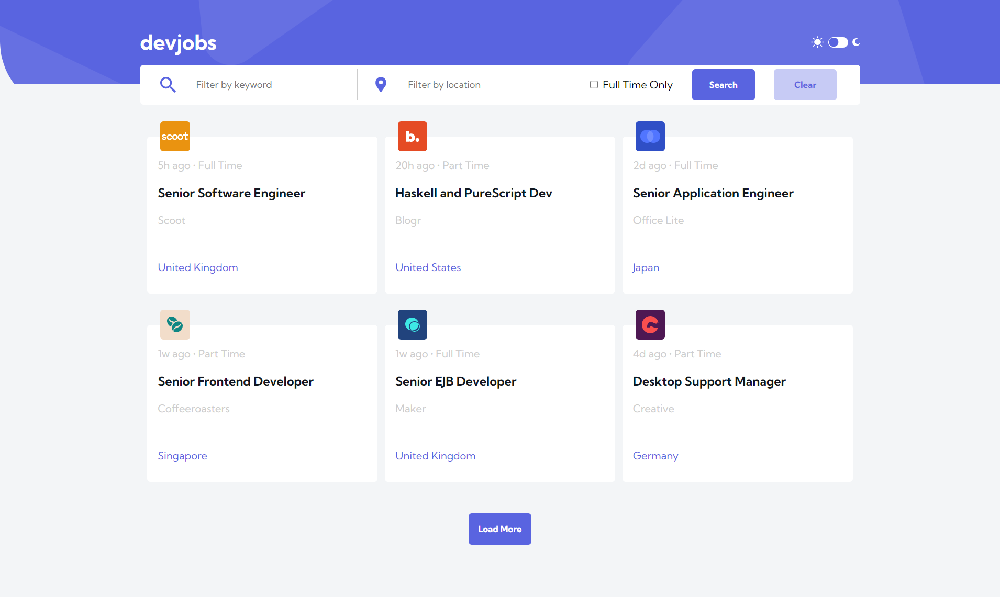
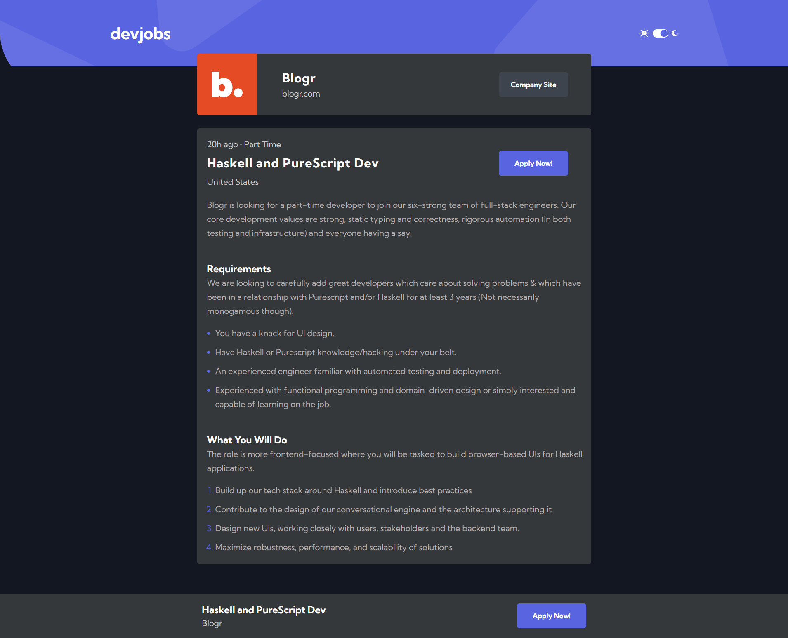
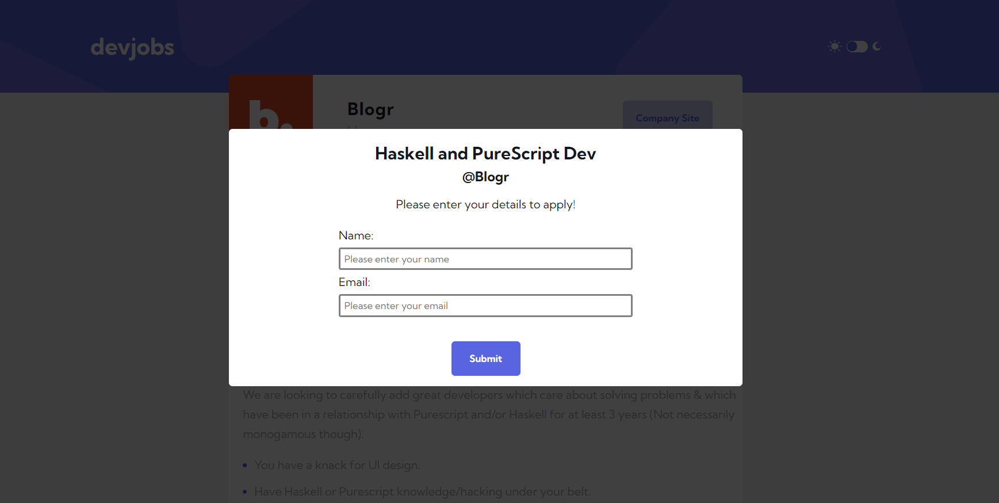
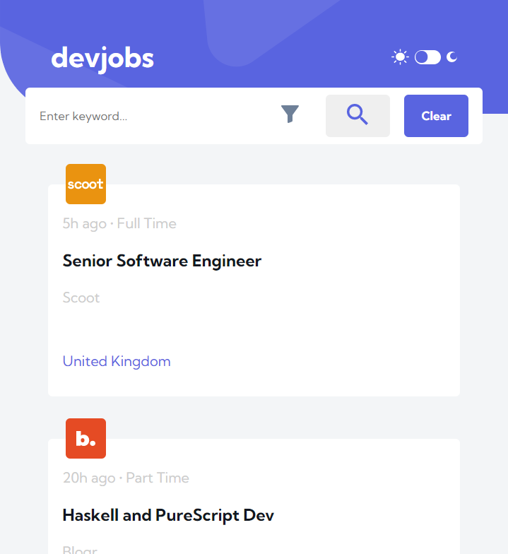

# Frontend Mentor - Devjobs web app solution

This is a solution to the [Devjobs web app challenge on Frontend Mentor](https://www.frontendmentor.io/challenges/devjobs-web-app-HuvC_LP4l). Frontend Mentor challenges help you improve your coding skills by building realistic projects.

## Table of contents

- [Overview](#overview)
  - [The challenge](#the-challenge)
  - [Screenshot](#screenshot)
  - [Links](#links)
- [My process](#my-process)
  - [Built with](#built-with)
  - [What I learned](#what-i-learned)
- [Author](#author)

## Overview

### The challenge

Users should be able to:

- View the optimal layout for each page depending on their device's screen size
- See hover states for all interactive elements throughout the site
- Be able to filter jobs on the index page by title, location, and whether a job is for a full-time position
- Be able to click a job from the index page so that they can read more information and apply for the job

### Screenshot 1 - Home Screen

### Screenshot 2 - Job Details (Dark Mode)

### Screenshot 3 - Job Application Portal

### Screenshot 4 - Mobile View

### Links

- Solution URL: [Add solution URL here](https://your-solution-url.com)
- Live Site URL: [Add live site URL here](https://your-live-site-url.com)

## My process

### Built with

- [React](https://reactjs.org/)
- [Sass](https://sass-lang.com/)
- [GraphQL](https://www.mapbox.com/)
- [Apollo](https://www.apollographql.com/)
- [Hasura](https://hasura.io/)
- [Figma](https://www.figma.com/)
- [Netlify](https://www.netlify.com/)

### What I learned

This was another Frontend Mentor challenge, although much more complex than the previous ones I have completed.

The challenge is supplied with all the job details in a local JSON file, but I wanted to experiment with GraphQL so I created a GraphQL API in Hasura, and used Apollo Client on the front end so I could use its hooks.

The jobs and job views are populated by GraphQL queries, and I also added a GraphQL mutation for when someone applies for a job - a table in Hasura is populated with the applicants name, email, job role and company.

Apollo also allowed me to practice with some GraphQL pagination, which was interesting - the home screen only loads 6 jobs initially, but then will load a further 6 on each fetch.

The app is fully responsive, which created some challenges when implementing the search - in desktop mode, I could simply pass an object from the searchbar component, but the mobile view Figma layout split the search terms between a mobile search bar and a pop-up, which I implemented using a portal. In hindsight, I may have considered Redux so I could just throw all queries to an external action and not have to have so much logic in my views.

I added a couple of extra pieces of functionality to the app as I thought the UI was a little unintuitive - there was no provision to clear search terms, for example.

There was also a challenge with populating the individual job detail components with the correct SVG, as they were still stored locally and not in the backend with the job detail data. In the end, I had to write a function in the JobTile component to asyncronously read them from the file system at build time and populate the component, which was satisfying. I found very little online as to how to do this, so I may add it to a blog sometime.

## Author

- Website - [Dan Bayford](https://bayford.dev/)
- Frontend Mentor - [@DanB-Web](https://www.frontendmentor.io/profile/DanB-Web)
